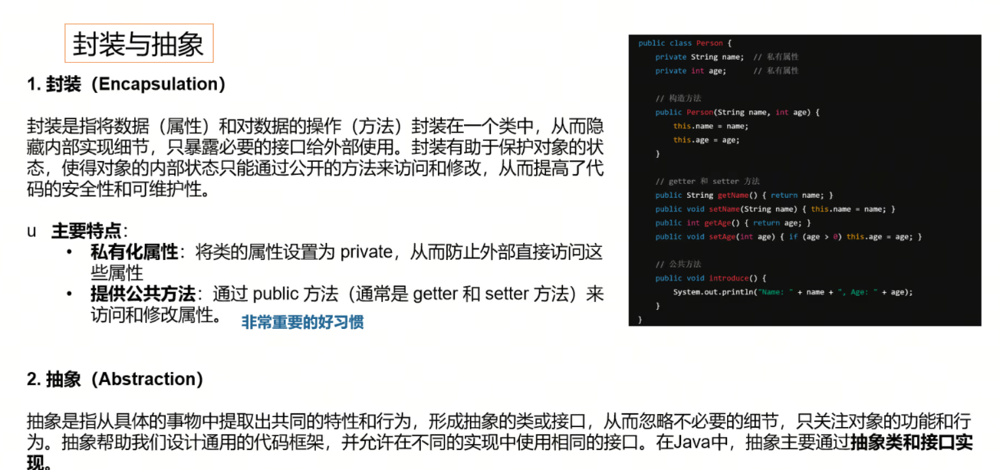

# Day1   Java基础
[](https://imgse.com/i/pVE9mct)
老师默认我们了解Java的相关知识，今天学习的主要内容是JavaSE的复习。
## 01 Java基础简介
### Java历史
[](https://imgse.com/i/pVE9tcq)
### Java语言特点
[](https://imgse.com/i/pVE9wHU)
- 强类型语言？？？
（程序跑起来之后里面每一个类型都是确定的）
静态类型检查：!!在程序编译阶段就会进行类型的检查，确保每个变量和函数的使用符合其声明的类型，不匹配时会立即提示错误。!!
提供类型安全：!!由于有静态检查机制，能防止类型错误在运行时出现，增强了程序的安全性和可靠性。!!
- 安全性？？？
沙箱机制： 指的是一种安全隔离技术，将程序限制在一个受控的执行环境中运行，防止其对系统其他部分产生影响。即使程序中存在恶意代码，也只能在沙箱中活动，不能访问关键系统资源。
运行时安全检查： 指程序在执行过程中进行的安全检查，比如内存访问是否越界、是否使用了未初始化的变量、是否有权限进行某些操作等。这有助于在程序运行时及时发现并阻止潜在的安全问题。
### Java应用领域
[](https://imgse.com/i/pVE9fHO)
市场上最主要的还是前后端分离的Web，其次就是移动端（个人理解，本质也是前后端分离），Java都作为后端服务。
**实时处理 vs 离线处理**
大数据处理中，实时处理和离线处理是两种主要的数据处理方式，它们的区别体现在处理时效性、技术架构、应用场景等方面。
实时处理是将流数据做一个切割，立即对其进行处理然后放回数据传输；离线处理类似一个延迟的汇总任务，是一个批处理。
| 项目           | 实时处理（Real-time Processing）           | 离线处理（Batch / Offline Processing）                |
|----------------|---------------------------------------------|--------------------------------------------------------|
| 处理时间       | 几毫秒到几秒内                              | 通常以分钟、小时甚至天为单位                          |
| 数据来源       | 流式数据（如日志流、传感器数据）           | 批量数据（如数据库、文件系统中的历史数据）           |
| 典型工具       | Apache Flink、Apache Storm、Kafka Streams  | Apache Hadoop、Apache Spark（批处理模式）            |
| 数据粒度       | 单条或小批量处理                            | 大批量数据处理                                        |
| 延迟（Latency）| 极低（低延迟）                              | 高延迟（可容忍）                                      |
| 应用场景       | 实时监控、欺诈检测、在线推荐                | 数据仓库分析、报表生成、训练机器学习模型             |
| 系统复杂度     | 更复杂（需要流处理架构）                    | 相对简单，容错性好                                    |
| 计算模型       | 流计算（Streaming）                         | 批处理（Batch）                                       |
### Java基础语法
#### 数据类型与变量
[](https://imgse.com/i/pVE9Xb8)
实际应用场景中，某些情况，浮点型数据传输是比较浪费的。如果对数据比较敏感，可以自己定义协议来规定数据传输类型（用整型？如何实现？）。
#### 运算符
[](https://imgse.com/i/pVECpCj)
#### 控制结构
[](https://imgse.com/i/pVECFK0)
#### 方法（定义与调用）
[](https://imgse.com/i/pVECAbT)
返回值有的可以通过参数列表返回？？？？
#### 递归调用
[](https://imgse.com/i/pVECnPJ)
快速排序，树的节点遍历，二分，斐波那契数列......
练习斐波那契数列：第一项和第二项均为一，从第三项开始，每一项都是前两项的和。
#### 异常（Exception&Error）
[](https://imgse.com/i/pVEChMq)
[](https://imgse.com/i/pVEC4s0)

- Error（错误）：表示运行时环境的错误。错误是程序无法处理的严重问题，如系统崩溃、虚拟机错误、动态链接失败等。通常，程序不应该尝试捕获这类错误。例如，OutOfMemoryError、StackOverflowError等。理论上能够捕获到，但是一般不会捕获，因为实际项目中遇到Error就直接重启服务了

- Exception（异常）：表示程序本身可以处理的异常条件。异常分为两大类：
    - 非运行时异常：这类异常在编译时期就必须被捕获或者声明抛出。它们通常是外部错误，如文件不存在（FileNotFoundException）、类未找到（ClassNotFoundException）等。非运行时异常强制程序员处理这些可能出现的问题，增强了程序的健壮性。
    - 运行时异常：这类异常包括运行时异常        （RuntimeException）和错误（Error）。运行时异常由程序错误导致，如空指针访问（NullPointerException）、数组越界（ArrayIndexOutOfBoundsException）等。运行时异常是不需要在编译时强制捕获或声明的。
    
    ```java
    public class Main {
    public static void main(String[] args) {
        try{
        int result = 10/0;

        }catch(RuntimeException e){
            System.out.println(e);

        }

    }
}
    ```
#### 类与对象

#### 继承与多态


避免重复造轮子，减少代码重复度
#### 封装与抽象

属性设置为private，通过setter和getter来访问和修改（Lombok通过@Data注解可以快速实现）；方法可以用public，因为方法是我们自己控制的
#### 接口与抽象类

