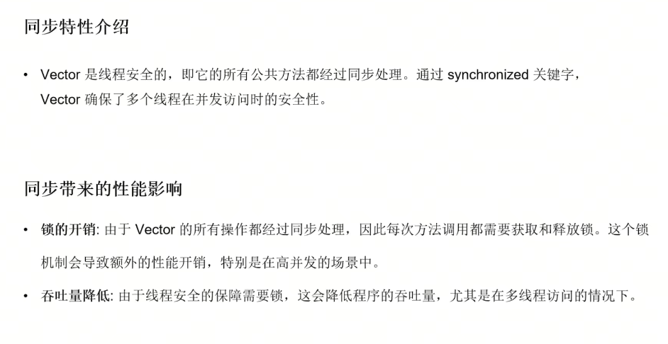
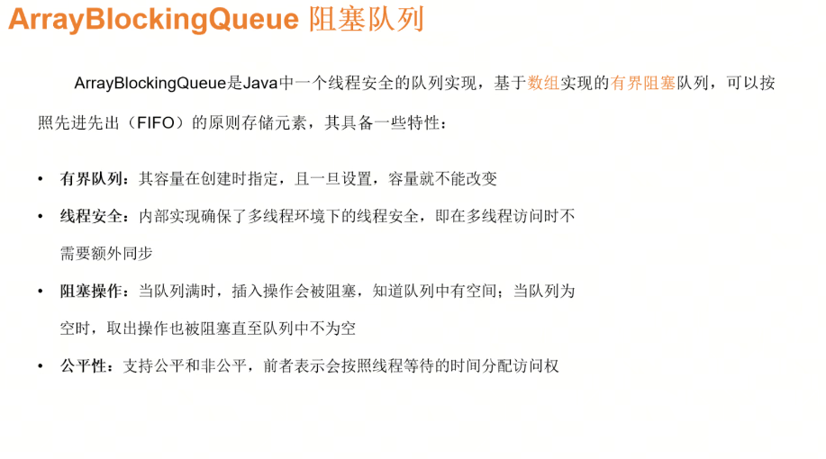
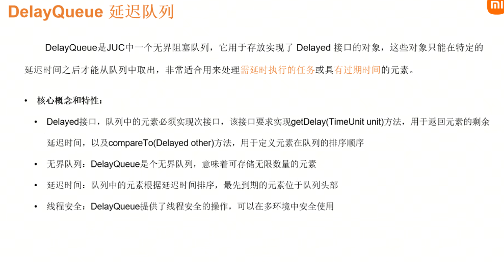
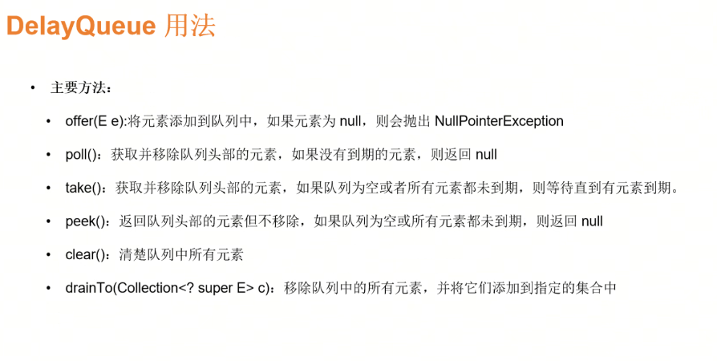

# Day2 Java泛型与集合
## 泛型
### 概念
Java泛型是在JavaSE 5引入的编程特性，它允许在编码时期是用类型参数来指定类型。
作用：
- 提升代码复用
- 增强类型安全
### 泛型引入动机
- 减少强制类型转换
- 增加类型安全
- 提高代码复用性和可读性
### 泛型类（泛型的一种用法）
泛型类定义格式：修饰符 class类名<代表泛型的变量>{}
### 泛型接口
定义和泛型类差不多
### 泛型通配符

#### 上界限定符

#### 下界限定符

#### 上下界限定符：PECS原则
在Java泛型中，知道算则使用extends还是super限定符。
### 泛型-编译期操作：类型擦除
写的时候指定了各种而样的类型，但是实际上编译出来泛型类型信息会被擦除。
S
#### 关于泛型数组

#### 高级特性-类型推断
是指编译器根据上下文信息，自动推断出泛型类型参数的具体类型。
#### 局限性汇总
- 类型擦除：会替换为上限类型或者Object类型
- 不能创建泛型数组：
- 基本类型不能作为类型参数
- 静态上下文的限制
- 异常处理的限制：不能用catch捕获
- 类型参数的限制
## Java集合
### Java 集合类概述
通常指Collection接口及其子接口和实现类
**为什么需要集合类**
- 动态大小
- 多种数据结构
- 高效操作、
- 易于使用
- 标准化：提供一组标准的接口和实现，促进代码可维护性和重用性
**集合类框架图**

用得比较多的：Set、ArrayList、LinkedList、Queue在业务里用的不多，性能优化可能会用（业务里面一般用消息队列实现）
### Collection 接口

迭代器的hasNext()方法别忘了
### List 接口
**List特点**
- 有序性：与添加顺序相同
- 可重复性
- 索引访问
- 动态大小
### ArrayList/LinkedList类
#### ArrayList
**内部数据结构**
底层用数组实现的，一段连续的内存空间。
**特点**
- 随机访问快
- 插入和删除相对较慢
#### LinkedList
基于链表实现
#### 同步

### Vector/Stack 类
Vector是线性安全的动态数组；stack是栈
### Set 接口
无序性
### HashSet/TreeSet 类
底层使用HashMap实现
#### 实现快速查找的原理
- 哈希函数
- 哈希桶
- 查找操作
### LinkedHashSet 类
底层实现：继承自HashSet
性能影响：略低于HashSet
应用场景：保证顺序且无重复，适合缓存等场景
### CopyOnWriteArrayList类
成本较高但是是线程安全的，每次写的时候都会创建一个新的空间用来存储新的list。
### ArrayBlockQueue类

### DelayQueue类

不常用
### Map 接口

### HashMap/TreeMap 类

### ConcurrentHashMap 类

### Iterator（迭代器）

### 集合工具类（如 Arrays、Collections）
### 比较器（Comparable 与 Comparator）

要使用Collections.sort方法进行集合中元素排序的话，元素必须实现Comparable接口
### 集合的选择与应用场景

功能是第一位

### 总结与展望
