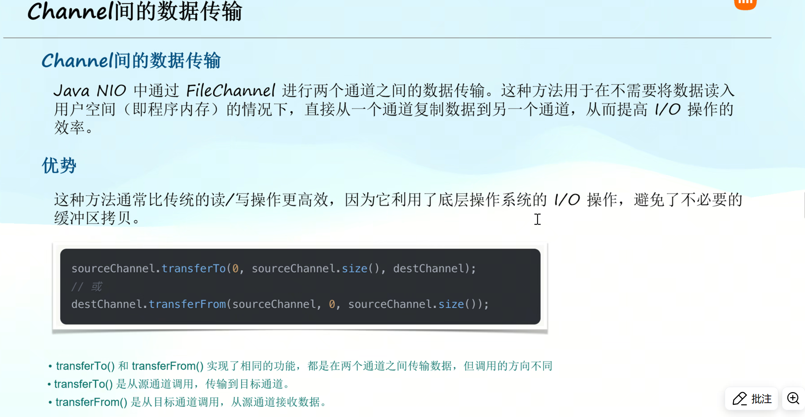
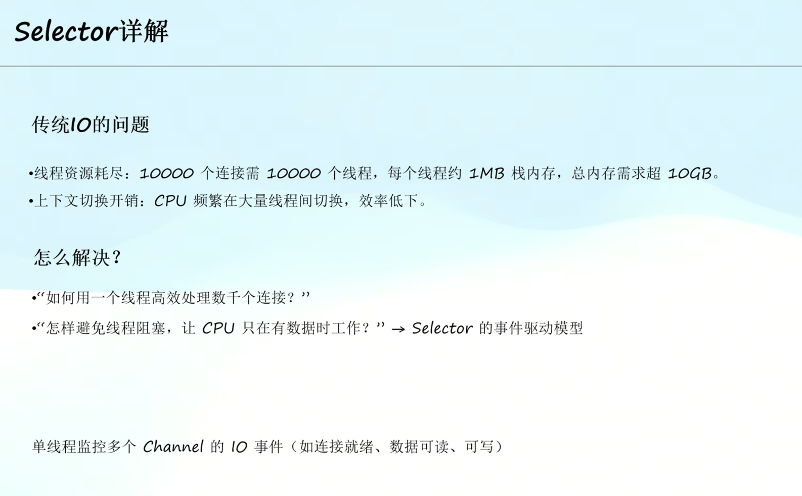
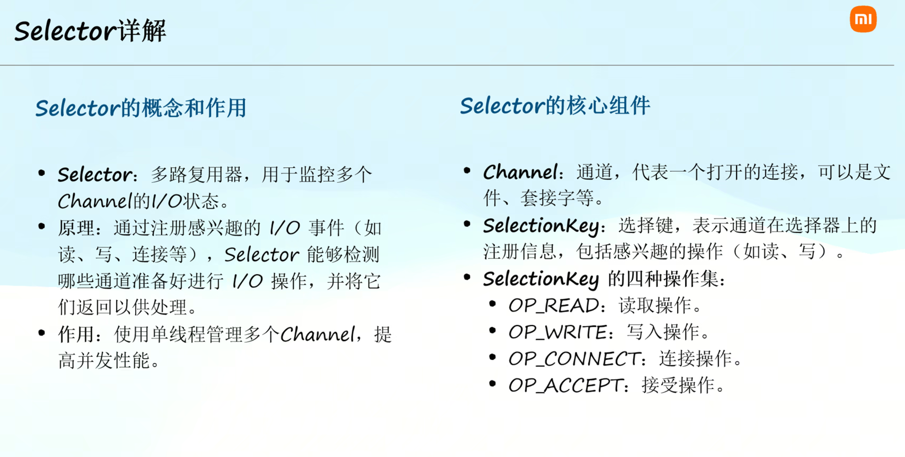
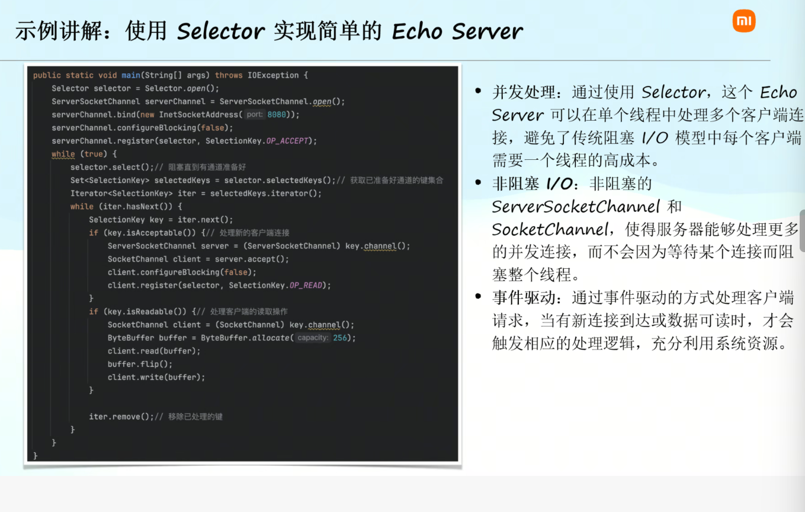

# Day2 JavaIO&设计模式
## 第1课 JavaI/O简介
### 二进制
0/1组成，电脑能够理解
二进制基本单位：
- 位Bit（0/1）
- 字节Byte（八位）
- 字Word（多个字节组成）

**核心组成**
字节流（InputStream/OutputStream）和字符流（Reader和Writer）

## 第2课 输入流、输出流和缓冲流

## 第4课 NIO

#### Buffer详解
**概念和类型**
- 概念：用于保存特定基本数据类型的容器
- 主要类型：
    - ByteBuffer
    - CharBuffer
    - ShortBuffer
    - IntBuffer
    - LongBuffer
    - FloatBuffer
    - DoubleBuffer
**Buffer重要属性**
- capacity：Buffer的容量，创建后不可改变
- position：下一个要读取或写入的数据的索引
- limit：第一个不应该读取或者写入的数据的索引
- mark：一个备忘位置
#### Channel详解

**FileChannel**

**Channel间的数据传输**

#### Selector详解

**示例讲解**

## 第5课 设计模式概述和创建型模式
### 设计模式简介
**什么是设计模式？**
- 设计模式是软件设计中常见问题的典型解决方案
- 它们是经过时间检验的最佳实践
- 时间模式不是具体的代码，而是解决问题的一般概念
**设计模式的分类**
、、、

#### 单例模式
确保类只有一个实例
#### 工厂方法模式
工厂方法模式的概念：
定义一个用于创建对象的接口
子类决定实例化哪一个类
（不再是我们new出来，而是工厂create出来）
**为什么用工厂模式呢？**
数据源越来越多，那么ifelse就会越来越多；但是工厂模式能够实现动态的判断切换数据源，提高代码的可维护性。
抽象工厂和普通工厂？？？？

## 第6课 结构性设计模式
结构性设计模式概述：
- 关注类和对象的组合方式，形成更复杂的结构以创建新的结构和功能
- 常见的结构性设计模式：
    - 适配器模式
    - 装饰器模式
    - ···
### 适配器模式
- 将一个类的接口转换成另一个接口
- 使得原本由于接口不兼容而不能一起工作的那些类可以一起工作
适配器模式的结构：
- Target：目标抽象类
- Adapter：适配器类
- Adaptee：适配者类
- Client：客户类
不一定是代码写得不对，有可能业务生态改变了，导致不适配。
在其他类里面调用另一个不适配的类，然后用这个新写的来实现就算一种适配。

### 装饰器模式
- 动态地给一个对象添加一些额外的职责
- 就新加功能而言，相比生成子类更加灵活

不要因为有这些模式就害怕重构，该重构就重构
## 行为型设计模式
### 观察者模式

### 策略模式
实际项目用得很少，写基本组件的时候可能会用到

