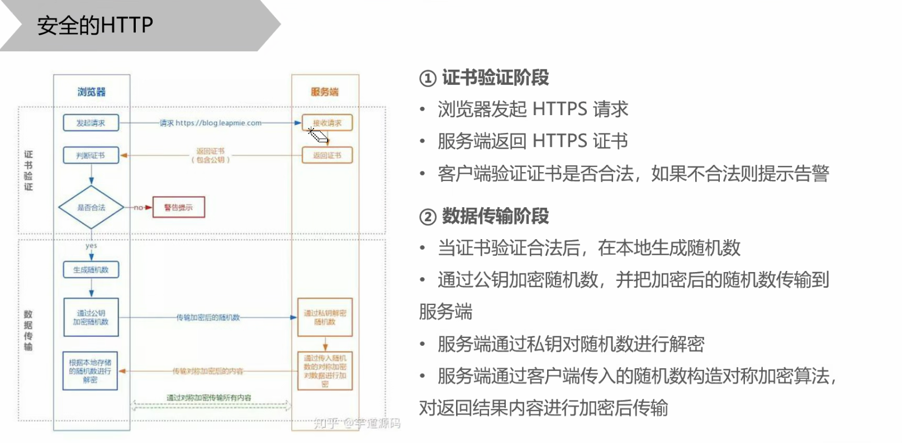
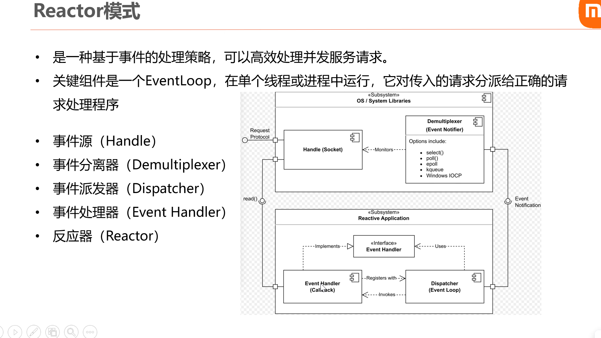
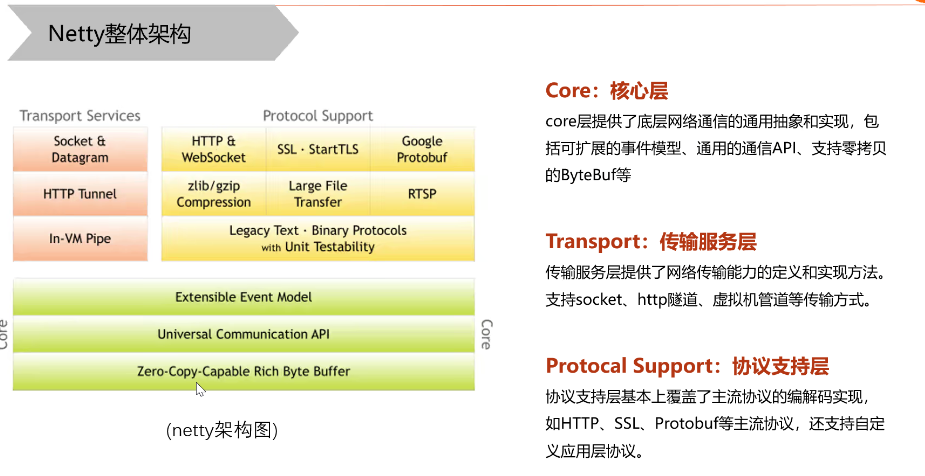
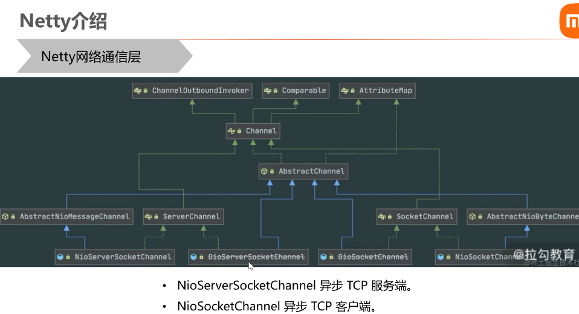
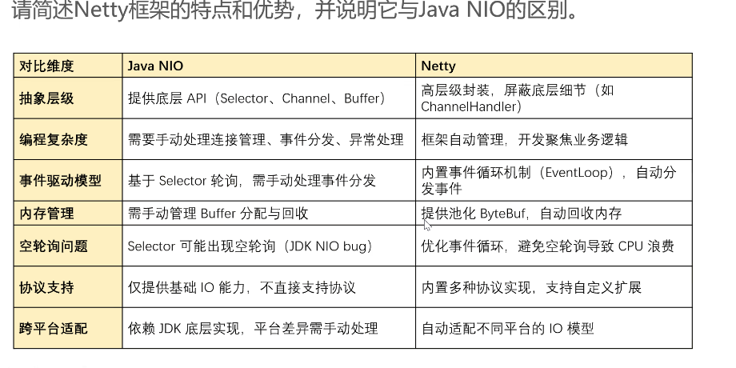

# Day5 网络编程
## HTTP概述
### 特点
- 支持客户端/服务端
- 简单快速
- 灵活
- 无状态
### 报文
#### 请求报文
请求行：请求方法+资源路径+http版本信息
请求头  例如Content-Type：application/json
空行：
请求体：
#### 响应报文
### 连接管理
http依赖TCP提供客户端到服务端的连接
#### 短链接
HTTP/0.9（1.0）默认每次请求都会建立一个TCP连接，响应后立刻关闭
HTTP/1.1中，只有当“collection”设置close时才会短链接

#### 长连接
一个TCP保持一段时间，重复用于发送接受请求
HTTP/1.1 使用keep-alive来保持长连接

#### 流水线模型

#### 队头阻塞

#### 缓解队头阻塞的策略

### 会话控制
#### Cookie

#### Session

### HTTPS

## HTTP2
做了一些功能升级，用得不是很多
- Multiplexed streams
- HTTP/2服务器推送
- 二进制协议
- 流优先级
- 有状态的标头压缩
### API介绍
Java标准库提供了基于HTTP的包，早期JDK版本是通过HttpURLConnection访问
主要涉及java.net.URL
java.net.HttpURLConnection
#### 创建HTTP Request
使用HttpRequest.newBuilder()

#### 常用的第三方库

## TCP/UDP介绍
两个都是传输层的协议
### TCP是面向连接的，可靠的，基于流的

#### 提供的功能
- 流数据传输
- 可靠性（三次握手、四次挥手）
- 流控（慢启动，拥塞控制）
- 多路复用（要借助操作系统顶层）
- 逻辑链接
- 全双工
#### 三次握手过程

#### 四次挥手过程

#### TCP窗口原则

**TCP拥塞控制**

### UDP是尽最大努力交付的
UDP（User Datagram Protocol，用户数据报协议）是一个简单的面向数据报的传输层协议，即进程的每个输出操作都产生一个UDP数据包，并封装成一个待发送的

**UDP Flood攻击**：利用大量UDP小宝撮箕DNS服务或者Redis
**SYN Flood攻击**：利用TCO协议的三次握手，发送大量伪造的TCP连接请求从而使得被攻击方资源耗尽
## WebSocket全双工
## 网络IO模型
### 阻塞IO（Blocking IO）
### 非阻塞IO（Nonblocking IO）需要轮询
### Reactor模式

## Netty架构

